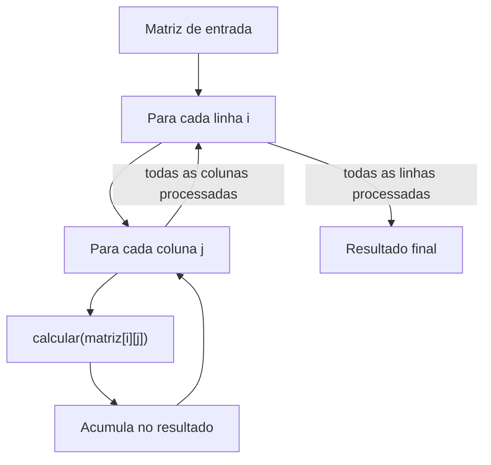
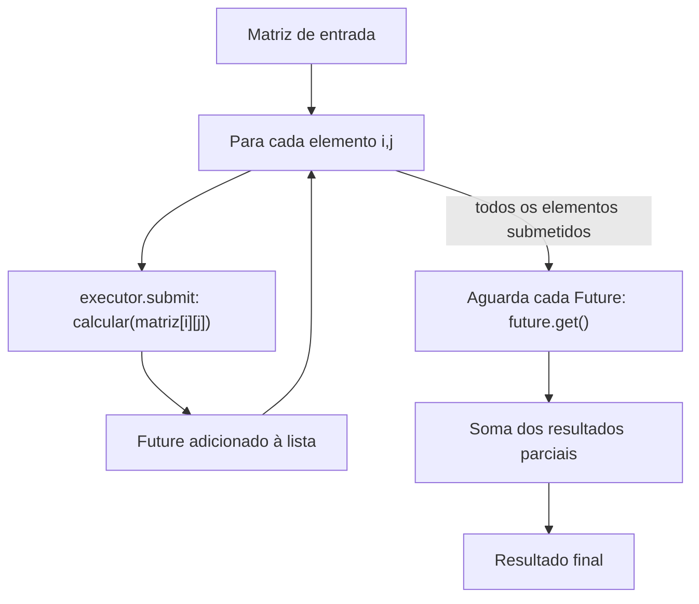

# Projeto Concorrência e Paralelismo

Desenvolvimento do projeto da disciplina de Programação Paralela.  
Professor: Rafael Nunes de Lima  
Aluna: Ana Beatriz Agostinho Astle  

## Objetivo do projeto

O projeto utilizará o processamento de uma grande matriz de números.
Para cada elemento da matriz deverá ser executada uma operação matematicamente custosa.
O projeto sequencial será fornecido pelo professor utilizando o repositório da disciplina.
```java
private static double calcular(double valor) {
    double resultado = valor;
    for (int i = 0; i < 1000; i++) {
        resultado +=
            Math.sin(valor + i)
            * Math.cos(valor - i)
            * Math.sqrt(Math.abs(valor) + 1);
    }
    return resultado;
}
```
O objetivo será processar todos os elementos da matriz e produzir um resultado final.
___
## Como rodar

- JDK 26
___
## Estrutura do Projeto

```
src/
├── Main.java                    # ponto de entrada — roda as 4 versões e imprime os tempos
├── v1/
│   └── Sequencial.java          # calcular() + processar() — baseline, sem paralelismo
├── v2/
│   └── NaoEstruturada.java      # calcular() + processarParalelo() com ExecutorService/threads manuais
├── v3/
│   └── Estruturado.java         # calcular() + processarEstruturado() com StructuredTaskScope
└── v4/
    └── EstadoCompartilhado.java # calcular() + duas variantes: AtomicInteger e ConcurrentLinkedQueue

resultados/
└── experimentos.csv             # tempo médio, speedup e nº de tarefas de cada rodada
```

- **`Main.java`** — orquestra a execução: chama cada versão, mede o tempo com `System.nanoTime()` e grava os resultados.
- **`v1` a `v4`** — cada pacote isola uma estratégia de paralelismo, mas compartilham a mesma `calcular()` sem alterações (é o que torna o speedup comparável entre elas).
- **`resultados/experimentos.csv`** — dados brutos dos experimentos (E1–E4), usados pra montar a tabela final e os gráficos, se você fizer algum.


___
## Diagrama de Arquitetura

### V1 - Sequencial - Baseline

### V2 - Não Estruturada



___
## Resultados

Metodologia: cada configuração foi executada 10 vezes; os valores abaixo são a média aritmética.
Ambiente: Apple M4 (10 núcleos), 16 GB RAM, OpenJDK 26.0.2.1, macOS.
Dados brutos de todas as execuções em [`resultados/experimentos.csv`](resultados/experimentos.csv).

### E1 — Matriz 500×500

| Implementação                          | Tarefas   | Tempo médio (ms) | Speedup | Resultado correto |
|-----------------------------------------|-----------|-------------------|---------|--------------------|
| Sequencial                              | -         | 1901.961          | 1.00    | -                  |
| Paralelismo não estruturado             | 250.000   | 384.121           | 4.95    | ✓                  |
| Paralelismo estruturado                 |           |                   |         |                    |
| Estruturado + AtomicInteger             |           |                   |         |                    |
| Estruturado + coleção concorrente       |           |                   |         |                    |

### E2 — Matriz 1000×1000

| Implementação                          | Tarefas   | Tempo médio (ms) | Speedup | Resultado correto |
|-----------------------------------------|-----------|-------------------|---------|--------------------|
| Sequencial                              | -         | 7575.528          | 1.00    | -                  |
| Paralelismo não estruturado             | 1.000.000 | 1738.497          | 4.36    | ✓                  |
| Paralelismo estruturado                 |           |                   |         |                    |
| Estruturado + AtomicInteger             |           |                   |         |                    |
| Estruturado + coleção concorrente       |           |                   |         |                    |

### E3 — Matriz 1500×1500

| Implementação                          | Tarefas   | Tempo médio (ms) | Speedup | Resultado correto |
|-----------------------------------------|-----------|-------------------|---------|--------------------|
| Sequencial                              | -         | 17093.514         | 1.00    | -                  |
| Paralelismo não estruturado             | 2.250.000 | 3903.985          | 4.38    | ✓                  |
| Paralelismo estruturado                 |           |                   |         |                    |
| Estruturado + AtomicInteger             |           |                   |         |                    |
| Estruturado + coleção concorrente       |           |                   |         |                    |

### E4 — Matriz 2000×2000

| Implementação                          | Tarefas   | Tempo médio (ms) | Speedup | Resultado correto |
|-----------------------------------------|-----------|-------------------|---------|--------------------|
| Sequencial                              | -         | 30289.086         | 1.00    | -                  |
| Paralelismo não estruturado             | 4.000.000 | 9602.464          | 3.15    | ✓                  |
| Paralelismo estruturado                 |           |                   |         |                    |
| Estruturado + AtomicInteger             |           |                   |         |                    |
| Estruturado + coleção concorrente       |           |                   |         |                    |

### Observações

- O resultado final é idêntico entre a versão sequencial e a não estruturada nos quatro tamanhos de matriz (ex.: E1 = `1264682.830998` em ambas), confirmando a corretude da paralelização.
- O speedup cai de ~4,4–4,95 para 3,15 no E4. A causa é a granularidade fina da v2 (uma tarefa por elemento): com 4 milhões de microtarefas, o custo de escalonamento e de alocação dos `Future`s passa a dominar parte do tempo de execução.


