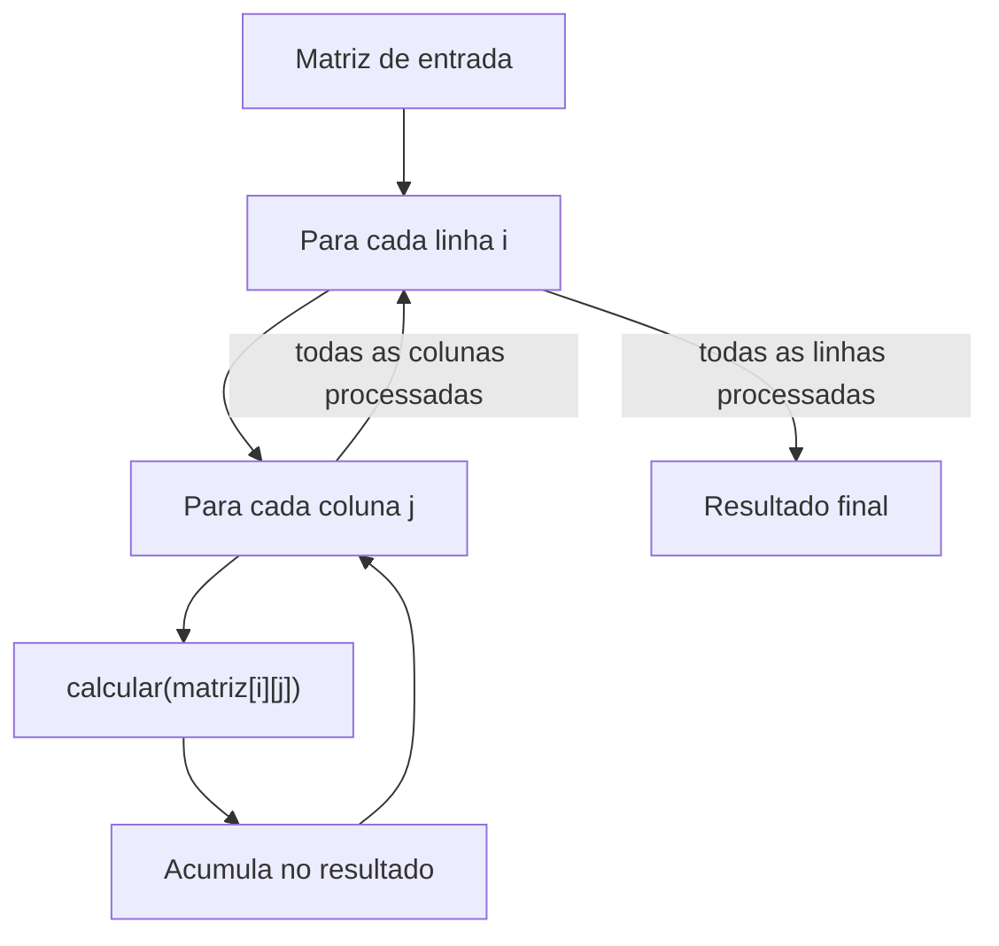
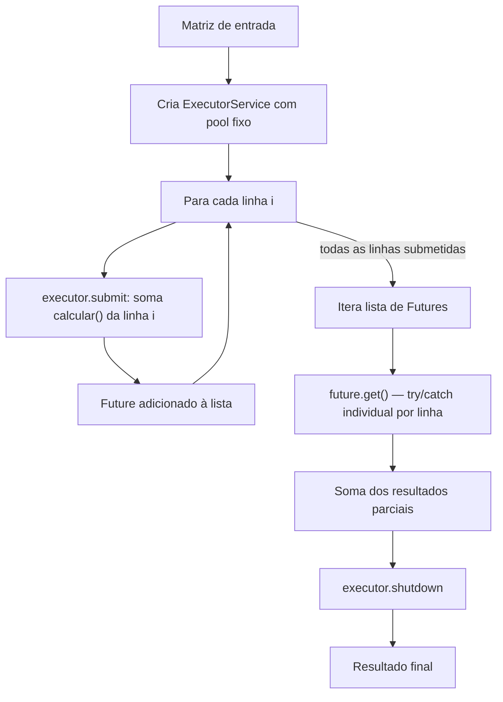
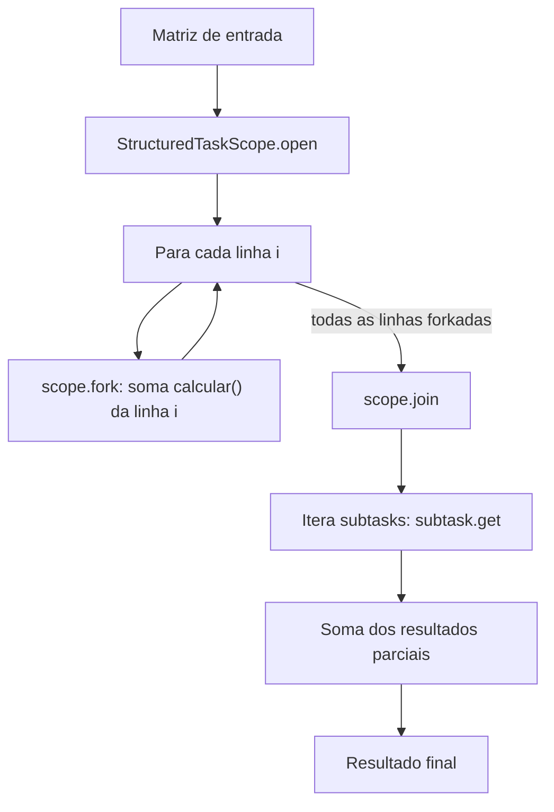

# Projeto Concorrência e Paralelismo

Desenvolvimento do projeto da disciplina de Programação Paralela.  
Professor: Rafael Nunes de Lima  
Aluna: Ana Beatriz Agostinho Astle  

## Objetivo do projeto

O projeto utilizará o processamento de uma grande matriz de números.
Para cada elemento da matriz deverá ser executada uma operação matematicamente custosa.
O projeto sequencial será fornecido pelo professor utilizando o repositório da disciplina.
```java
private static double calcular(double valor) {
    double resultado = valor;
    for (int i = 0; i < 1000; i++) {
        resultado +=
            Math.sin(valor + i)
            * Math.cos(valor - i)
            * Math.sqrt(Math.abs(valor) + 1);
    }
    return resultado;
}
```
O objetivo será processar todos os elementos da matriz e produzir um resultado final.
___
## Como rodar

**Pré-requisito:** JDK 26

### 1. Compilar

Na raiz do projeto:

```bash
javac --enable-preview --release 26 -d out src/*.java src/*/*.java
```

O padrão `src/*/*.java` compila todas as versões existentes (v1–v4). Os `.class` são gerados no diretório `out/`. O flag `--enable-preview` é obrigatório porque a v3 usa `StructuredTaskScope`, que é API preview no JDK 26.

### 2. Executar uma versão

Cada versão tem seu próprio `main` com menu interativo:

```bash
java -cp out Main                           # versão base fornecida pelo professor (sequencial)
java -cp out v1.Sequencial                  # v1 — baseline sequencial
java -cp out v2.NaoEstruturada              # v2 — paralelismo não estruturado (ExecutorService)
java --enable-preview -cp out v3.Estruturada    # v3 — paralelismo estruturado (StructuredTaskScope)
java --enable-preview -cp out v4.EstadoCompartilhado  # v4 — estado compartilhado (DoubleAdder / ConcurrentLinkedQueue)
```

> **Nota:** v3 e v4 exigem `--enable-preview` também na execução, pois usam `StructuredTaskScope`. O menu da v4 é diferente: opções 1–4 rodam a variante com variável atômica e opções 5–8 rodam a variante com coleção concorrente.
```

No menu, escolha o tamanho da matriz:

```
1 - Matriz 500 x 500
2 - Matriz 1000 x 1000
3 - Matriz 1500 x 1500
4 - Matriz 2000 x 2000
0 - Exit
```

A saída exibe o resultado da soma de todos os elementos e o tempo de processamento (ms e segundos).

### 3. Testar / reproduzir os experimentos

Para rodar sem interação, envie as opções pela entrada padrão:

```bash
# uma execução da matriz 500x500 em cada versão
printf '1\n0\n' | java -cp out v1.Sequencial
printf '1\n0\n' | java -cp out v2.NaoEstruturada
printf '1\n0\n' | java --enable-preview -cp out v3.Estruturada
printf '1\n0\n' | java --enable-preview -cp out v4.EstadoCompartilhado
```

**Verificação de corretude:** a matriz é gerada de forma determinística, então todas as versões devem imprimir **exatamente o mesmo resultado** para um mesmo tamanho. Referências:

| Matriz    | Resultado esperado |
|-----------|--------------------|
| 500×500   | 1264682.830998     |
| 1000×1000 | 5058731.323995     |
| 1500×1500 | 11382145.478991    |
| 2000×2000 | 20234925.296071    |

Se alguma versão paralela produzir valor diferente da baseline, há problema na implementação — com uma exceção: as versões que acumulam somas parciais por linha (v2, v3) reassociam as operações de ponto flutuante e podem diferir da baseline nas últimas casas decimais. Isso é esperado e não indica erro. Referências para v2/v3: 500×500 → `1264682.830999`, 1000×1000 → `5058731.323995`, 1500×1500 → `11382145.478988`, 2000×2000 → `20234925.295979`.

Para reproduzir a metodologia da seção [Resultados](#resultados) (10 rodadas por configuração, média aritmética), repita a opção desejada 10 vezes antes do `0`:

```bash
printf '1\n1\n1\n1\n1\n1\n1\n1\n1\n1\n0\n' | java -cp out v2.NaoEstruturada
```
___
## Estrutura do Projeto

```
src/
├── Main.java                    # ponto de entrada — roda as 4 versões e imprime os tempos
├── v1/
│   └── Sequencial.java          # calcular() + processar() — baseline, sem paralelismo
├── v2/
│   └── NaoEstruturada.java      # calcular() + processarParalelo() com ExecutorService/threads manuais
├── v3/
│   └── Estruturada.java         # calcular() + processar() com StructuredTaskScope
└── v4/
    └── EstadoCompartilhado.java # calcular() + duas variantes: variável atômica (DoubleAdder) e coleção concorrente (ConcurrentLinkedQueue)

resultados/
└── experimentos.csv             # tempo médio, speedup e nº de tarefas de cada rodada
```

- **`Main.java`** — orquestra a execução: chama cada versão, mede o tempo com `System.nanoTime()` e grava os resultados.
- **`v1` a `v4`** — cada pacote isola uma estratégia de paralelismo, mas compartilham a mesma `calcular()` sem alterações (é o que torna o speedup comparável entre elas).
- **`resultados/experimentos.csv`** — dados brutos dos experimentos (E1–E4), usados pra montar a tabela final e os gráficos, se você fizer algum.


___
## Diagrama de Arquitetura

### V1 - Sequencial - Baseline


### V2 - Não Estruturada


### V3 - Estruturada


___
## Resultados

Metodologia: cada configuração foi executada 10 vezes; os valores abaixo são a média aritmética.
Ambiente: Apple M4 (10 núcleos), 16 GB RAM, OpenJDK 26.0.2.1, macOS.
Dados brutos de todas as execuções em [`resultados/experimentos.csv`](resultados/experimentos.csv).

### E1 — Matriz 500×500

| Implementação                          | Tarefas   | Tempo médio (ms) | Speedup | Resultado correto |
|-----------------------------------------|-----------|-------------------|---------|--------------------|
| Sequencial                              | -         | 1901.961          | 1.00    | -                  |
| Paralelismo não estruturado             | 500       | 315.730           | 6.02    | ✓                  |
| Paralelismo estruturado                 | 500       | 338.520           | 5.62    | ✓                  |
| Estruturado + variável atômica          | 500       | 319.190           | 5.96    | ✓                  |
| Estruturado + coleção concorrente       | 500       | 329.366           | 5.77    | ✓                  |

### E2 — Matriz 1000×1000

| Implementação                          | Tarefas   | Tempo médio (ms) | Speedup | Resultado correto |
|-----------------------------------------|-----------|-------------------|---------|--------------------|
| Sequencial                              | -         | 7575.528          | 1.00    | -                  |
| Paralelismo não estruturado             | 1.000     | 1286.758          | 5.89    | ✓                  |
| Paralelismo estruturado                 | 1.000     | 1405.512          | 5.39    | ✓                  |
| Estruturado + variável atômica          | 1.000     | 1338.755          | 5.66    | ✓                  |
| Estruturado + coleção concorrente       | 1.000     | 1394.195          | 5.43    | ✓                  |

### E3 — Matriz 1500×1500

| Implementação                          | Tarefas   | Tempo médio (ms) | Speedup | Resultado correto |
|-----------------------------------------|-----------|-------------------|---------|--------------------|
| Sequencial                              | -         | 17093.514         | 1.00    | -                  |
| Paralelismo não estruturado             | 1.500     | 3240.849          | 5.27    | ✓                  |
| Paralelismo estruturado                 | 1.500     | 3314.722          | 5.16    | ✓                  |
| Estruturado + variável atômica          | 1.500     | 3218.168          | 5.31    | ✓                  |
| Estruturado + coleção concorrente       | 1.500     | 3599.949          | 4.75    | ✓                  |

### E4 — Matriz 2000×2000

| Implementação                          | Tarefas   | Tempo médio (ms) | Speedup | Resultado correto |
|-----------------------------------------|-----------|-------------------|---------|--------------------|
| Sequencial                              | -         | 30289.086         | 1.00    | -                  |
| Paralelismo não estruturado             | 2.000     | 5799.812          | 5.22    | ✓                  |
| Paralelismo estruturado                 | 2.000     | 6292.796          | 4.81    | ✓                  |
| Estruturado + variável atômica          | 2.000     | 5859.672          | 5.17    | ✓                  |
| Estruturado + coleção concorrente       | 2.000     | 6029.526          | 5.02    | ✓                  |

### Observações

- A v2 foi refatorada de uma tarefa por elemento para **uma tarefa por linha**, e o efeito no speedup foi direto: no E4 subiu de 3,15 para 5,22 (antes: 4 milhões de microtarefas; agora: 2.000 tarefas); no E1, de 4,95 para 6,02.
- A v3 (estruturada) usa a mesma granularidade da v2 (uma subtarefa por linha) e ficou consistentemente um pouco atrás (≈5–8%). A causa provável é o modelo de threads: o `StructuredTaskScope` dispara uma virtual thread por subtarefa, enquanto a v2 usa um pool fixo de threads de plataforma dimensionado pelo número de núcleos — para carga CPU-bound, o pool fixo tem menos overhead de agendamento. Em troca, a v3 garante que todas as subtarefas terminem antes do escopo fechar e propaga falhas automaticamente, sem gerenciamento manual de `shutdown()` e `Future`s.
- As versões v2/v3 acumulam somas parciais por linha, o que reassocia as operações de ponto flutuante: os resultados podem diferir da baseline nas últimas casas decimais (ex.: E1 → v1 = `1264682.830998`, v2/v3 = `1264682.830999`). É esperado e não indica erro.
- As duas variantes da v4 (estado compartilhado) ficaram no mesmo patamar da v2/v3: como a granularidade é de uma tarefa por linha, o estado compartilhado é atualizado apenas 500–2.000 vezes por execução, e o custo de sincronização fica diluído. A variante com variável atômica (`DoubleAdder`) foi ligeiramente mais rápida que a coleção concorrente em todos os tamanhos — o `DoubleAdder` espalha os acumuladores em células internas, reduzindo a disputa entre threads. Em todas as rodadas da v4 o resultado impresso foi idêntico ao de v2/v3.


